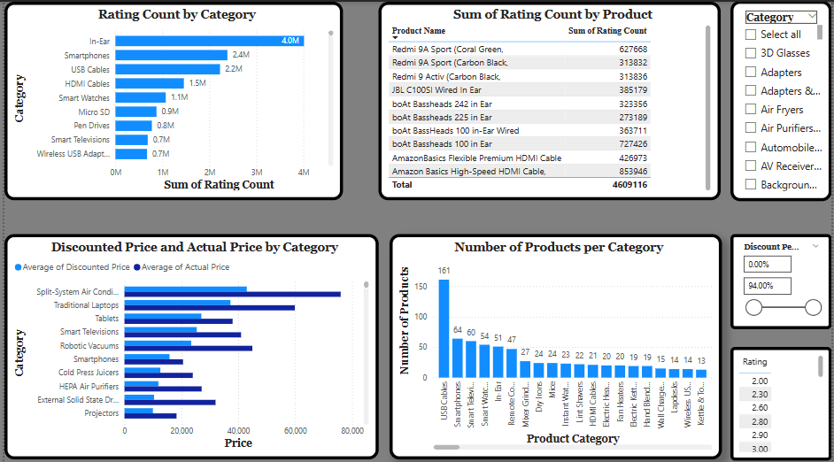
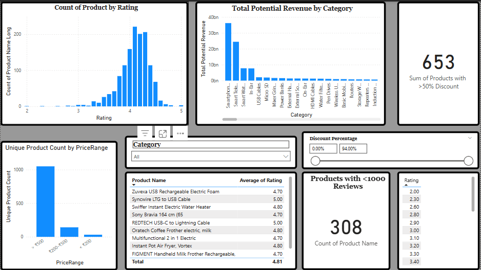
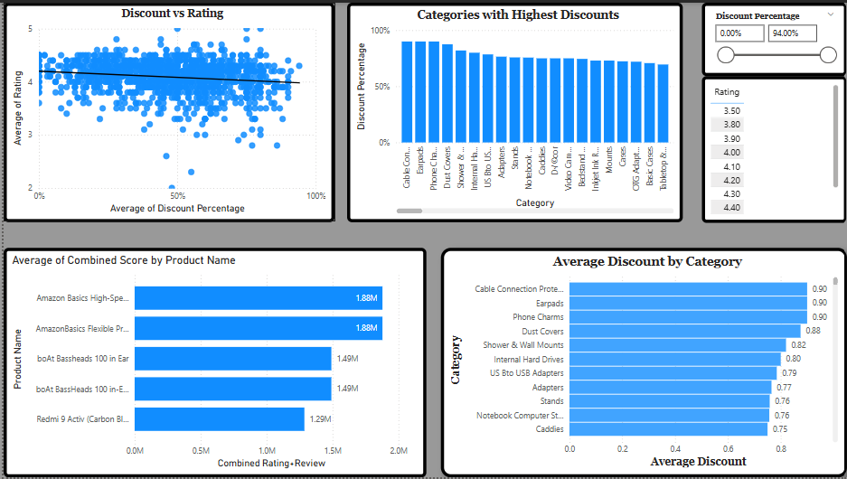

# 🛒 Amazon Product Review Analysis

## 🧑‍💼 Project Context
You are working as a Junior Data Analyst at **RetailTech Insights**, a company that provides e-commerce analytics solutions to sellers on platforms like Amazon. Your team was tasked with analyzing product and customer review data to generate insights that can guide product improvement, marketing strategies, and customer engagement.

---

## 📊 Dataset Description
The dataset contains information scraped from Amazon product pages, including:
- **Product details**: Name, category, price, discount, ratings
- **Customer engagement**: Review count, review titles, and content
- **Structure**: 1,465 rows × 16 columns

---

## 🧠 Key Analysis Tasks & Questions Answered
1. What is the average discount percentage by product category?
2. How many products are listed under each category?
3. What is the total number of reviews per category?
4. Which products have the highest average ratings?
5. What is the average actual price vs. discounted price by category?
6. Which products have the highest number of reviews?
7. How many products have a discount of 50% or more?
8. What is the distribution of product ratings (e.g., how many are rated 3.0, 4.0, etc.)?
9. What is the total potential revenue (actual_price × rating_count) by category?
10. What is the number of unique products per price range bucket?
11. How does the rating relate to the level of discount?
12. How many products have fewer than 1,000 reviews?
13. Which categories have products with the highest discounts?
14. Identify the top 5 products in terms of rating and number of reviews combined.

---

## 📸 Key Visuals

### 📊 First Dashboard Page  

### 📈 Second Dashboard Page  

### 💰 Third Dashboard Page  

---

## 📎 Files
- Amazon_Product_Review_initial-file.xlsx
- Amazon_Case_Study_semi-cleaned.xlsx
- Folder with some visuals _check .pbix file using MS Power BI to see complete model_
- README.md file

---

## 🧰 Tools Used
- Microsoft Excel (for preliminary data cleaning)
- Microsoft Power BI (for the rest of the analysis)
